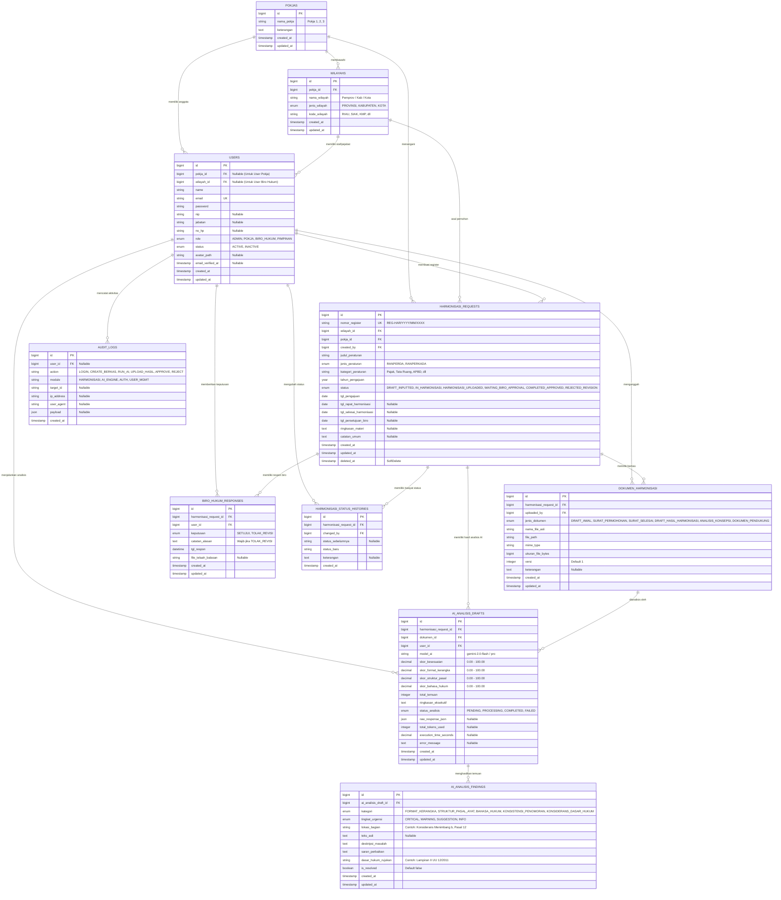

# DOKUMEN RANCANGAN DATABASE & ENTITY RELATIONSHIP DIAGRAM (ERD)
## APLIKASI HARMONITAS (Harmonisasi Ranperda dan Ranperkada Tuntas)
**Kantor Wilayah Kementerian Hukum Provinsi Riau**

---

## 1. PENDAHULUAN

Dokumen ini berisi spesifikasi teknis arsitektur basis data (*database schema*), diagram relasi antar entitas (*Entity Relationship Diagram / ERD*), rincian kamus data (*data dictionary*), dan aturan relasi (*relationship constraints*) untuk aplikasi **HARMONITAS**.

Rancangan database ini dioptimalkan untuk framework **Laravel 12 / 11** dengan RDBMS **MySQL 8.0+ / MariaDB 10.4+ / PostgreSQL 15+**, mendukung integritas data referensial, audit trail, riwayat status (*lifecycle tracking*), dan integrasi AI Pra-Harmonisasi (*Legal Drafting Checker*).

---

## 2. ENTITY RELATIONSHIP DIAGRAM (ERD)



---

## 3. KAMUS DATA & RINCIAN TABEL (*DATA DICTIONARY*)

### 3.1 Tabel `pokjas`
Menyimpan 3 kelompok kerja (Pokja) Kanwil Kementerian Hukum Provinsi Riau.

| Nama Kolom | Tipe Data | Nullable | Default | Keterangan & Aturan |
| :--- | :--- | :--- | :--- | :--- |
| `id` | `BIGINT UNSIGNED` | No | Auto Increment | Primary Key |
| `nama_pokja` | `VARCHAR(50)` | No | - | Nama Pokja: `Pokja 1`, `Pokja 2`, `Pokja 3` |
| `keterangan` | `TEXT` | Yes | NULL | Deskripsi cakupan Pokja |
| `created_at` | `TIMESTAMP` | Yes | NULL | Waktu pembuatan data |
| `updated_at` | `TIMESTAMP` | Yes | NULL | Waktu pembaruan data |

---

### 3.2 Tabel `wilayahs`
Menyimpan 13 entitas wilayah di Provinsi Riau (1 Provinsi + 12 Kabupaten/Kota) yang dipetakan ke masing-masing Pokja.

| Nama Kolom | Tipe Data | Nullable | Default | Keterangan & Aturan |
| :--- | :--- | :--- | :--- | :--- |
| `id` | `BIGINT UNSIGNED` | No | Auto Increment | Primary Key |
| `pokja_id` | `BIGINT UNSIGNED` | No | - | Foreign Key ke `pokjas.id` (ON DELETE RESTRICT) |
| `nama_wilayah` | `VARCHAR(100)` | No | - | Nama resmi wilayah (misal: `Kabupaten Siak`) |
| `jenis_wilayah` | `ENUM` | No | - | Nilai: `'PROVINSI'`, `'KABUPATEN'`, `'KOTA'` |
| `kode_wilayah` | `VARCHAR(20)` | No | - | Unique identifier (misal: `RIAU`, `SIAK`, `KMP`) |
| `created_at` | `TIMESTAMP` | Yes | NULL | Waktu pembuatan data |
| `updated_at` | `TIMESTAMP` | Yes | NULL | Waktu pembaruan data |

> **Indeks:**  
> - `UNIQUE KEY uq_wilayahs_kode (kode_wilayah)`  
> - `INDEX idx_wilayahs_pokja (pokja_id)`

---

### 3.3 Tabel `users`
Menyimpan seluruh data pengguna aplikasi dengan Role-Based Access Control (RBAC).

| Nama Kolom | Tipe Data | Nullable | Default | Keterangan & Aturan |
| :--- | :--- | :--- | :--- | :--- |
| `id` | `BIGINT UNSIGNED` | No | Auto Increment | Primary Key |
| `pokja_id` | `BIGINT UNSIGNED` | Yes | NULL | Foreign Key ke `pokjas.id` (Wajib diisi jika role = `POKJA`) |
| `wilayah_id` | `BIGINT UNSIGNED` | Yes | NULL | Foreign Key ke `wilayahs.id` (Wajib diisi jika role = `BIRO_HUKUM`) |
| `name` | `VARCHAR(255)` | No | - | Nama lengkap pengguna |
| `email` | `VARCHAR(255)` | No | - | Email login pengguna (Unique) |
| `password` | `VARCHAR(255)` | No | - | Hash kata sandi (Bcrypt/Argon2) |
| `nip` | `VARCHAR(30)` | Yes | NULL | NIP ASN (opsional) |
| `jabatan` | `VARCHAR(100)` | Yes | NULL | Jabatan struktural/fungsional |
| `no_hp` | `VARCHAR(20)` | Yes | NULL | Kontak WhatsApp / Telepon |
| `role` | `ENUM` | No | - | Nilai: `'ADMIN'`, `'POKJA'`, `'BIRO_HUKUM'`, `'PIMPINAN'` |
| `status` | `ENUM` | No | `'ACTIVE'` | Nilai: `'ACTIVE'`, `'INACTIVE'` |
| `avatar_path` | `VARCHAR(255)` | Yes | NULL | Path foto profil |
| `email_verified_at`| `TIMESTAMP` | Yes | NULL | Waktu verifikasi email |
| `remember_token`| `VARCHAR(100)` | Yes | NULL | Token sesi login "Remember Me" |
| `created_at` | `TIMESTAMP` | Yes | NULL | Waktu registrasi akun |
| `updated_at` | `TIMESTAMP` | Yes | NULL | Waktu pembaruan akun |

> **Indeks:**  
> - `UNIQUE KEY uq_users_email (email)`  
> - `INDEX idx_users_role (role)`  
> - `INDEX idx_users_pokja (pokja_id)`  
> - `INDEX idx_users_wilayah (wilayah_id)`

---

### 3.4 Tabel `harmonisasi_requests`
Tabel transaksi utama untuk permohonan dan registrasi naskah Ranperda / Ranperkada.

| Nama Kolom | Tipe Data | Nullable | Default | Keterangan & Aturan |
| :--- | :--- | :--- | :--- | :--- |
| `id` | `BIGINT UNSIGNED` | No | Auto Increment | Primary Key |
| `nomor_register` | `VARCHAR(50)` | No | - | Nomor registrasi otomatis (Format: `REG-HAR/YYYY/MM/XXXX`) |
| `wilayah_id` | `BIGINT UNSIGNED` | No | - | Foreign Key ke `wilayahs.id` |
| `pokja_id` | `BIGINT UNSIGNED` | No | - | Foreign Key ke `pokjas.id` (Otomatis mewarisi wilayah) |
| `created_by` | `BIGINT UNSIGNED` | No | - | Foreign Key ke `users.id` (Anggota Pokja yang mendaftarkan) |
| `judul_peraturan`| `VARCHAR(500)` | No | - | Judul lengkap regulasi yang diharmonisasi |
| `jenis_peraturan`| `ENUM` | No | - | Nilai: `'RANPERDA'`, `'RANPERKADA'` |
| `kategori_peraturan`| `VARCHAR(100)` | No | `'Umum'` | Sektor/Kategori (Pajak, RTRW, APBD, Kelembagaan, dll.) |
| `tahun_pengajuan`| `YEAR` | No | - | Tahun anggaran/permohonan (misal: 2026) |
| `status` | `ENUM` | No | `'DRAFT_INPUTTED'` | Nilai status: <br>1. `'DRAFT_INPUTTED'`<br>2. `'IN_HARMONISASI'`<br>3. `'HARMONISASI_UPLOADED'`<br>4. `'WAITING_BIRO_APPROVAL'`<br>5. `'COMPLETED_APPROVED'`<br>6. `'REJECTED_REVISION'` |
| `tgl_pengajuan` | `DATE` | No | - | Tanggal input permohonan |
| `tgl_rapat_harmonisasi` | `DATE` | Yes | NULL | Tanggal rapat pleno harmonisasi digelar |
| `tgl_selesai_harmonisasi`| `DATE` | Yes | NULL | Tanggal berkas hasil harmonisasi selesai diunggah |
| `tgl_persetujuan_biro` | `DATE` | Yes | NULL | Tanggal keputusan akhir dari Biro/Bagian Hukum |
| `ringkasan_materi`| `TEXT` | Yes | NULL | Pokok substansi atau latar belakang singkat regulasi |
| `catatan_umum` | `TEXT` | Yes | NULL | Catatan tambahan proses |
| `created_at` | `TIMESTAMP` | Yes | NULL | Waktu pembuatan record |
| `updated_at` | `TIMESTAMP` | Yes | NULL | Waktu update status/data |
| `deleted_at` | `TIMESTAMP` | Yes | NULL | Soft Delete untuk proteksi data |

> **Indeks:**  
> - `UNIQUE KEY uq_harmonisasi_nomor (nomor_register)`  
> - `INDEX idx_harmonisasi_status (status)`  
> - `INDEX idx_harmonisasi_wilayah (wilayah_id)`  
> - `INDEX idx_harmonisasi_pokja (pokja_id)`  
> - `INDEX idx_harmonisasi_jenis (jenis_peraturan)`  
> - `INDEX idx_harmonisasi_tahun (tahun_pengajuan)`

---

### 3.5 Tabel `dokumen_harmonisasi`
Menyimpan semua file dokumen digital (draf awal, surat permohonan, surat hasil, naskah hasil rapat, analisis konsepsi, dokumen pendukung).

| Nama Kolom | Tipe Data | Nullable | Default | Keterangan & Aturan |
| :--- | :--- | :--- | :--- | :--- |
| `id` | `BIGINT UNSIGNED` | No | Auto Increment | Primary Key |
| `harmonisasi_request_id` | `BIGINT UNSIGNED` | No | - | Foreign Key ke `harmonisasi_requests.id` (CASCADE) |
| `uploaded_by` | `BIGINT UNSIGNED` | No | - | Foreign Key ke `users.id` (Pengunggah berkas) |
| `jenis_dokumen` | `ENUM` | No | - | Nilai: <br>• `'DRAFT_AWAL'`<br>• `'SURAT_PERMOHONAN'`<br>• `'SURAT_SELESAI'`<br>• `'DRAFT_HASIL_HARMONISASI'`<br>• `'ANALISIS_KONSEPSI'`<br>• `'DOKUMEN_PENDUKUNG'` |
| `nama_file_asli` | `VARCHAR(255)` | No | - | Nama file asli (misal: `Draft_Ranperda_Siak_v1.docx`) |
| `file_path` | `VARCHAR(500)` | No | - | Path file di storage (misal: `documents/harmonisasi/2026/...`) |
| `mime_type` | `VARCHAR(100)` | No | - | Contoh: `application/pdf`, `application/vnd.openxmlformats-officedocument.wordprocessingml.document` |
| `ukuran_file_bytes`| `BIGINT UNSIGNED` | No | - | Ukuran file dalam satuan byte |
| `versi` | `INT UNSIGNED` | No | `1` | Nomor revisi/versi dokumen |
| `keterangan` | `TEXT` | Yes | NULL | Catatan khusus file |
| `created_at` | `TIMESTAMP` | Yes | NULL | Waktu unggah |
| `updated_at` | `TIMESTAMP` | Yes | NULL | Waktu pembaruan |

> **Indeks:**  
> - `INDEX idx_dokumen_request (harmonisasi_request_id)`  
> - `INDEX idx_dokumen_jenis (jenis_dokumen)`

---

### 3.6 Tabel `ai_analisis_drafts`
Menyimpan hasil agregasi pemindaian AI Pra-Harmonisasi (*Legal Drafting Checker* berbasis UU 12/2011 & UU 13/2022).

| Nama Kolom | Tipe Data | Nullable | Default | Keterangan & Aturan |
| :--- | :--- | :--- | :--- | :--- |
| `id` | `BIGINT UNSIGNED` | No | Auto Increment | Primary Key |
| `harmonisasi_request_id` | `BIGINT UNSIGNED` | No | - | Foreign Key ke `harmonisasi_requests.id` (CASCADE) |
| `dokumen_id` | `BIGINT UNSIGNED` | No | - | Foreign Key ke `dokumen_harmonisasi.id` (Berkas draft yang dianalisis) |
| `user_id` | `BIGINT UNSIGNED` | No | - | Foreign Key ke `users.id` (Pokja yang menjalankan AI) |
| `model_ai` | `VARCHAR(50)` | No | `'gemini-2.0-flash'` | Model LLM yang digunakan |
| `skor_kesesuaian` | `DECIMAL(5,2)` | No | `0.00` | Skor total kepatuhan format naskah (0 - 100) |
| `skor_format_kerangka` | `DECIMAL(5,2)` | No | `0.00` | Skor judul, konsiderans, diktum, penutup |
| `skor_struktur_pasal` | `DECIMAL(5,2)` | No | `0.00` | Skor konsistensi pasal, ayat, huruf, angka |
| `skor_bahasa_hukum` | `DECIMAL(5,2)` | No | `0.00` | Skor kata baku & ketepatan frasa hukum |
| `total_temuan` | `INT UNSIGNED` | No | `0` | Jumlah total temuan masalah/kesalahan |
| `ringkasan_eksekutif`| `TEXT` | No | - | Ringkasan narasi hasil telaah otomatis AI |
| `status_analisis` | `ENUM` | No | `'PENDING'` | Nilai: `'PENDING'`, `'PROCESSING'`, `'COMPLETED'`, `'FAILED'` |
| `raw_response_json` | `JSON` | Yes | NULL | Respon mentah JSON dari API AI |
| `total_tokens_used` | `INT UNSIGNED` | Yes | NULL | Penggunaan token API |
| `execution_time_seconds`| `DECIMAL(6,2)` | Yes | NULL | Lama waktu eksekusi proses analisis |
| `error_message` | `TEXT` | Yes | NULL | Pesan error jika status `FAILED` |
| `created_at` | `TIMESTAMP` | Yes | NULL | Waktu mulai analisis |
| `updated_at` | `TIMESTAMP` | Yes | NULL | Waktu selesai analisis |

> **Indeks:**  
> - `INDEX idx_ai_request (harmonisasi_request_id)`  
> - `INDEX idx_ai_dokumen (dokumen_id)`  
> - `INDEX idx_ai_status (status_analisis)`

---

### 3.7 Tabel `ai_analisis_findings`
Menyimpan rincian butir temuan ketidaksesuaian naskah dan saran perbaikan dari AI.

| Nama Kolom | Tipe Data | Nullable | Default | Keterangan & Aturan |
| :--- | :--- | :--- | :--- | :--- |
| `id` | `BIGINT UNSIGNED` | No | Auto Increment | Primary Key |
| `ai_analisis_draft_id` | `BIGINT UNSIGNED` | No | - | Foreign Key ke `ai_analisis_drafts.id` (CASCADE) |
| `kategori` | `ENUM` | No | - | Nilai: <br>• `'FORMAT_KERANGKA'`<br>• `'STRUKTUR_PASAL_AYAT'`<br>• `'BAHASA_HUKUM'`<br>• `'KONSISTENSI_PENOMORAN'`<br>• `'KONSIDERANS_DASAR_HUKUM'` |
| `tingkat_urgensi` | `ENUM` | No | `'WARNING'` | Nilai: `'CRITICAL'`, `'WARNING'`, `'SUGGESTION'`, `'INFO'` |
| `lokasi_bagian` | `VARCHAR(255)` | No | - | Lokasi teks (misal: `Konsiderans Menimbang Huruf b`, `Pasal 15 Ayat (3)`) |
| `teks_asli` | `TEXT` | Yes | NULL | Kalimat/frasa asli yang bermasalah pada naskah |
| `deskripsi_masalah` | `TEXT` | No | - | Penjelasan alasan ketidaksesuaian |
| `saran_perbaikan` | `TEXT` | No | - | Usulan teks rekomendasi perbaikan |
| `dasar_hukum_rujukan`| `VARCHAR(255)` | Yes | NULL | Dasar acuan (misal: `Lampiran II Angka 45 UU No. 12 Tahun 2011`) |
| `is_resolved` | `BOOLEAN` | No | `false` | Status apakah perancang sudah menindaklanjuti |
| `created_at` | `TIMESTAMP` | Yes | NULL | Waktu dibuat |
| `updated_at` | `TIMESTAMP` | Yes | NULL | Waktu diupdate |

> **Indeks:**  
> - `INDEX idx_findings_draft (ai_analisis_draft_id)`  
> - `INDEX idx_findings_kategori (kategori)`  
> - `INDEX idx_findings_urgensi (tingkat_urgensi)`

---

### 3.8 Tabel `biro_hukum_responses`
Menyimpan catatan validasi dan respon akhir dari Biro Hukum Pemprov atau Bagian Hukum Pemkab/Pemkot.

| Nama Kolom | Tipe Data | Nullable | Default | Keterangan & Aturan |
| :--- | :--- | :--- | :--- | :--- |
| `id` | `BIGINT UNSIGNED` | No | Auto Increment | Primary Key |
| `harmonisasi_request_id` | `BIGINT UNSIGNED` | No | - | Foreign Key ke `harmonisasi_requests.id` (CASCADE) |
| `user_id` | `BIGINT UNSIGNED` | No | - | Foreign Key ke `users.id` (Pejabat Biro Hukum yang merespon) |
| `keputusan` | `ENUM` | No | - | Nilai: `'SETUJUI'`, `'TOLAK_REVISI'` |
| `catatan_alasan` | `TEXT` | Yes | NULL | Wajib diisi jika `keputusan` = `'TOLAK_REVISI'` |
| `tgl_respon` | `DATETIME` | No | CURRENT_TIMESTAMP | Waktu resmi respon diberikan |
| `file_telaah_balasan`| `VARCHAR(500)` | Yes | NULL | Path dokumen catatan resmi telaah jika dilampirkan |
| `created_at` | `TIMESTAMP` | Yes | NULL | Waktu record dibuat |
| `updated_at` | `TIMESTAMP` | Yes | NULL | Waktu record diupdate |

> **Indeks:**  
> - `INDEX idx_biro_request (harmonisasi_request_id)`  
> - `INDEX idx_biro_keputusan (keputusan)`

---

### 3.9 Tabel `harmonisasi_status_histories`
Audit log riwayat perpindahan status tahapan permohonan (*Lifecycle State Machine*).

| Nama Kolom | Tipe Data | Nullable | Default | Keterangan & Aturan |
| :--- | :--- | :--- | :--- | :--- |
| `id` | `BIGINT UNSIGNED` | No | Auto Increment | Primary Key |
| `harmonisasi_request_id` | `BIGINT UNSIGNED` | No | - | Foreign Key ke `harmonisasi_requests.id` (CASCADE) |
| `changed_by` | `BIGINT UNSIGNED` | No | - | Foreign Key ke `users.id` (User yang memicu perubahan) |
| `status_sebelumnya` | `VARCHAR(50)` | Yes | NULL | Status lama sebelum berubah |
| `status_baru` | `VARCHAR(50)` | No | - | Status baru yang aktif |
| `keterangan` | `TEXT` | Yes | NULL | Catatan konteks perpindahan status |
| `created_at` | `TIMESTAMP` | No | CURRENT_TIMESTAMP | Waktu kejadian |

---

### 3.10 Tabel `audit_logs`
Merekam jejak audit keamanan seluruh aktivitas pengguna dalam sistem.

| Nama Kolom | Tipe Data | Nullable | Default | Keterangan & Aturan |
| :--- | :--- | :--- | :--- | :--- |
| `id` | `BIGINT UNSIGNED` | No | Auto Increment | Primary Key |
| `user_id` | `BIGINT UNSIGNED` | Yes | NULL | Foreign Key ke `users.id` (ON DELETE SET NULL) |
| `action` | `VARCHAR(100)` | No | - | Kode aksi: `LOGIN`, `CREATE_BERKAS`, `RUN_AI`, dll. |
| `module` | `VARCHAR(50)` | No | - | Modul: `HARMONISASI`, `AI_ENGINE`, `AUTH`, `USER_MGMT` |
| `target_id` | `VARCHAR(100)` | Yes | NULL | ID entitas yang diproses (misal: ID harmonisasi_requests) |
| `ip_address` | `VARCHAR(45)` | Yes | NULL | IP Address client (IPv4/IPv6) |
| `user_agent` | `TEXT` | Yes | NULL | Informasi browser / device pengguna |
| `payload` | `JSON` | Yes | NULL | Snapshot data yang diubah/dikirim |
| `created_at` | `TIMESTAMP` | No | CURRENT_TIMESTAMP | Waktu aktivitas tercatat |

---

## 4. PENJELASAN RELASI ANTAR TABEL (*RELATIONSHIPS*)

### 1. Relasi Pokja & Wilayah (`pokjas` 1 — ∞ `wilayahs`)
* **Jenis Relasi:** One-to-Many
* **Deskripsi:** Satu Pokja (Pokja 1, 2, atau 3) membina dan membawahi banyak entitas wilayah (Provinsi/Kabupaten/Kota).
* **Foreign Key:** `wilayahs.pokja_id` mengacu ke `pokjas.id`.
* **Constraint:** `ON DELETE RESTRICT` (Pokja tidak boleh dihapus jika masih membawahi wilayah).

### 2. Relasi Pengguna ke Pokja & Wilayah (`users` ke `pokjas` & `wilayahs`)
* **Role POKJA:** Terikat ke `pokjas.id` (hanya dapat mengelola berkas di wilayah binaan Pokja tersebut).
* **Role BIRO_HUKUM:** Terikat ke `wilayahs.id` (hanya dapat melihat dan merespon berkas dari daerahnya sendiri).
* **Role ADMIN & PIMPINAN:** `pokja_id` dan `wilayah_id` bernilai `NULL` (memiliki akses lintas seluruh 13 wilayah di Riau).

### 3. Relasi Permohonan Harmonisasi (`harmonisasi_requests`)
* **Ke `wilayahs` (Many-to-One):** Setiap berkas permohonan berasal dari satu wilayah tertentu (`wilayah_id`).
* **Ke `pokjas` (Many-to-One):** Setiap berkas ditugaskan ke satu Pokja penanggung jawab (`pokja_id`).
* **Ke `users` (Many-to-One):** Dicatat siapa anggota Pokja yang menginput/mendaftarkan berkas (`created_by`).

### 4. Relasi Berkas Dokumen Digital (`harmonisasi_requests` 1 — ∞ `dokumen_harmonisasi`)
* **Jenis Relasi:** One-to-Many
* **Deskripsi:** Satu berkas permohonan memiliki banyak dokumen digital di setiap tahapannya:
  - Tahap Awal: `DRAFT_AWAL`, `SURAT_PERMOHONAN`.
  - Tahap Pasca-Rapat: `SURAT_SELESAI`, `DRAFT_HASIL_HARMONISASI`, `ANALISIS_KONSEPSI`, `DOKUMEN_PENDUKUNG`.
* **Foreign Key:** `dokumen_harmonisasi.harmonisasi_request_id` mengacu ke `harmonisasi_requests.id`.
* **Constraint:** `ON DELETE CASCADE`.

### 5. Relasi Hasil AI & Temuan (`ai_analisis_drafts` 1 — ∞ `ai_analisis_findings`)
* **`harmonisasi_requests` 1 — ∞ `ai_analisis_drafts`:** Satu berkas permohonan dapat dilakukan pemindaian AI beberapa kali (misal versi 1, versi 2 setelah draf diperbaiki).
* **`ai_analisis_drafts` 1 — ∞ `ai_analisis_findings`:** Satu sesi pemindaian AI menghasilkan banyak rincian butir temuan (*findings*) dan saran perbaikan.
* **Constraint:** `ON DELETE CASCADE`.

### 6. Relasi Respon Biro Hukum (`harmonisasi_requests` 1 — ∞ `biro_hukum_responses`)
* **Jenis Relasi:** One-to-Many (karena jika ditolak/perlu revisi, proses perbaikan dapat berulang hingga disetujui akhir).
* **Deskripsi:** Menyimpan rekam jejak persetujuan (*approval*) atau penolakan (*rejection*) beserta alasan resmi dan telaah balik dari Biro/Bagian Hukum.

### 7. Relasi Audit & Riwayat Status (`harmonisasi_requests` 1 — ∞ `harmonisasi_status_histories`)
* **Jenis Relasi:** One-to-Many
* **Deskripsi:** Merekam jejak setiap kali status berkas berpindah (`DRAFT_INPUTTED` -> `IN_HARMONISASI` -> `HARMONISASI_UPLOADED` -> `WAITING_BIRO_APPROVAL` -> `COMPLETED_APPROVED` / `REJECTED_REVISION`).

---

## 5. SEEDER MASTER DATA WILAYAH & POKJA KANWIL RIAU

Data awal (*initial seeders*) yang wajib dimasukkan ke database:

```sql
-- 1. Insert Data Pokja
INSERT INTO pokjas (id, nama_pokja, keterangan, created_at, updated_at) VALUES
(1, 'Pokja 1', 'Membawahi Pemprov Riau, Siak, Kampar, Inhil, Bengkalis', NOW(), NOW()),
(2, 'Pokja 2', 'Membawahi Rokan Hulu, Inhu, Meranti, Dumai', NOW(), NOW()),
(3, 'Pokja 3', 'Membawahi Kuansing, Pelalawan, Rohil, Pekanbaru', NOW(), NOW());

-- 2. Insert Data 13 Wilayah
INSERT INTO wilayahs (id, pokja_id, nama_wilayah, jenis_wilayah, kode_wilayah, created_at, updated_at) VALUES
-- Pokja 1
(1, 1, 'Pemerintah Provinsi Riau', 'PROVINSI', 'RIAU-PROV', NOW(), NOW()),
(2, 1, 'Kabupaten Siak', 'KABUPATEN', 'KAB-SIAK', NOW(), NOW()),
(3, 1, 'Kabupaten Kampar', 'KABUPATEN', 'KAB-KMP', NOW(), NOW()),
(4, 1, 'Kabupaten Indragiri Hilir', 'KABUPATEN', 'KAB-INHIL', NOW(), NOW()),
(5, 1, 'Kabupaten Bengkalis', 'KABUPATEN', 'KAB-BKL', NOW(), NOW()),

-- Pokja 2
(6, 2, 'Kabupaten Rokan Hulu', 'KABUPATEN', 'KAB-ROHUL', NOW(), NOW()),
(7, 2, 'Kabupaten Indragiri Hulu', 'KABUPATEN', 'KAB-INHU', NOW(), NOW()),
(8, 2, 'Kabupaten Kepulauan Meranti', 'KABUPATEN', 'KAB-MERANTI', NOW(), NOW()),
(9, 2, 'Kota Dumai', 'KOTA', 'KOTA-DUMAI', NOW(), NOW()),

-- Pokja 3
(10, 3, 'Kabupaten Kuantan Singingi', 'KABUPATEN', 'KAB-KUANSING', NOW(), NOW()),
(11, 3, 'Kabupaten Pelalawan', 'KABUPATEN', 'KAB-PELALAWAN', NOW(), NOW()),
(12, 3, 'Kabupaten Rokan Hilir', 'KABUPATEN', 'KAB-ROHIL', NOW(), NOW()),
(13, 3, 'Kota Pekanbaru', 'KOTA', 'KOTA-PEKANBARU', NOW(), NOW());
```

---

## 6. REKOMENDASI KELAS ELOQUENT MODEL (LARAVEL)

Untuk implementasi di Laravel, berikut pemetaan Model dan relasinya:

1. **`App\Models\Pokja`**:
   - `hasMany(Wilayah::class)`
   - `hasMany(User::class)`
   - `hasMany(HarmonisasiRequest::class)`

2. **`App\Models\Wilayah`**:
   - `belongsTo(Pokja::class)`
   - `hasMany(User::class)`
   - `hasMany(HarmonisasiRequest::class)`

3. **`App\Models\User`**:
   - `belongsTo(Pokja::class)`
   - `belongsTo(Wilayah::class)`
   - `hasMany(HarmonisasiRequest::class, 'created_by')`
   - `hasMany(DokumenHarmonisasi::class, 'uploaded_by')`
   - `hasMany(BiroHukumResponse::class)`

4. **`App\Models\HarmonisasiRequest`**:
   - `belongsTo(Wilayah::class)`
   - `belongsTo(Pokja::class)`
   - `belongsTo(User::class, 'created_by')`
   - `hasMany(DokumenHarmonisasi::class)`
   - `hasMany(AiAnalisisDraft::class)`
   - `hasMany(BiroHukumResponse::class)`
   - `hasMany(HarmonisasiStatusHistory::class)`

5. **`App\Models\DokumenHarmonisasi`**:
   - `belongsTo(HarmonisasiRequest::class)`
   - `belongsTo(User::class, 'uploaded_by')`
   - `hasMany(AiAnalisisDraft::class, 'dokumen_id')`

6. **`App\Models\AiAnalisisDraft`**:
   - `belongsTo(HarmonisasiRequest::class)`
   - `belongsTo(DokumenHarmonisasi::class, 'dokumen_id')`
   - `belongsTo(User::class)`
   - `hasMany(AiAnalisisFinding::class)`

7. **`App\Models\AiAnalisisFinding`**:
   - `belongsTo(AiAnalisisDraft::class)`

8. **`App\Models\BiroHukumResponse`**:
   - `belongsTo(HarmonisasiRequest::class)`
   - `belongsTo(User::class)`

9. **`App\Models\HarmonisasiStatusHistory`**:
   - `belongsTo(HarmonisasiRequest::class)`
   - `belongsTo(User::class, 'changed_by')`
