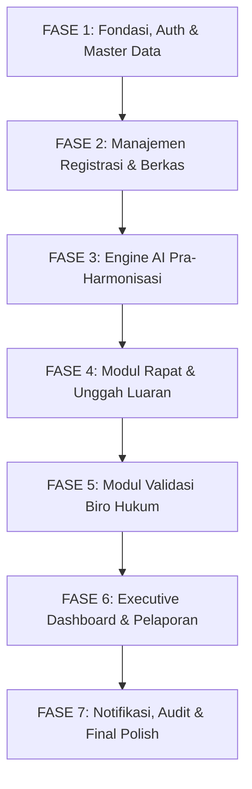

# DOKUMEN ROADMAP & URUTAN PENGEMBANGAN FITUR
## APLIKASI HARMONITAS (Harmonisasi Ranperda dan Ranperkada Tuntas)
**Kantor Wilayah Kementerian Hukum Provinsi Riau**

---

## 1. PENDAHULUAN

Dokumen ini memetakan tahapan prioritas pengembangan sistem (*Feature Implementation Roadmap*) aplikasi **HARMONITAS** secara bertahap (*incremental & agile*). Urutan ini disusun secara logis berdasarkan dependensi fungsional antar-modul, mulai dari fondasi autentikasi, manajemen data master, alur pengajuan berkas, integrasi kecerdasan buatan (AI), modul persetujuan biro hukum, hingga dashboard monitoring eksekutif.

---

## 2. MATRIKS TAHAPAN PENGEMBANGAN (*DEVELOPMENT PHASES*)

---

## 3. RINCIAN URUTAN FITUR PER FASE

### 🔷 FASE 1: Fondasi Sistem, Autentikasi & Master Data (Minggu 1)
> **Tujuan:** Menyiapkan struktur dasar database, autentikasi aman, dan manajemen pengguna berbasis peran (RBAC).

1. **Setup & Konfigurasi Basis:**
   - [x] Inisialisasi Database MySQL & Laravel Eloquent Models.
   - [ ] Konfigurasi layout utama Inertia React + Tailwind CSS dengan tema institusional (*Kanwil Kemenkumham Riau*).
2. **Autentikasi & Keamanan (Multi-Role Auth):**
   - [ ] Halaman Login yang responsif dan aman (CSRF, Rate Limiting).
   - [ ] Middleware proteksi Role: `ADMIN`, `POKJA`, `BIRO_HUKUM`, `PIMPINAN`.
   - [ ] Fitur Edit Profil, Ganti Password, dan Avatar.
3. **Modul Master Data Wilayah & Pokja (Admin):**
   - [ ] CRUD Master Pokja (Pokja 1, Pokja 2, Pokja 3).
   - [ ] CRUD Master 13 Wilayah (Pemprov Riau & 12 Pemkab/Pemkot).
   - [ ] Pemetaan wilayah binaan otomatis ke Pokja terkait.
4. **Modul Manajemen Pengguna / User Management (Admin):**
   - [ ] Pengelolaan akun staf Pokja (diikat ke `pokja_id`).
   - [ ] Pengelolaan akun pejabat Biro/Bagian Hukum (diikat ke `wilayah_id`).
   - [ ] Pengelolaan akun Pimpinan Kanwil & Administrator.

---

### 🔷 FASE 2: Registrasi Berkas & Manajemen Dokumen Awal (Minggu 2)
> **Tujuan:** Memfasilitasi Pokja untuk mendaftarkan permohonan Ranperda/Ranperkada dan mengunggah berkas naskah.

1. **Form Registrasi Permohonan Baru (Pokja):**
   - [ ] Generator otomatis Nomor Registrasi: `REG-HAR/YYYY/MM/XXXX`.
   - [ ] Pemilihan wilayah pemohon (otomatis terfilter sesuai hak akses Pokja yang login).
   - [ ] Input data metadata: Judul Regulasi, Jenis (`RANPERDA`/`RANPERKADA`), Kategori/Sektor, Tahun Anggaran, dan Ringkasan Pokok Regulasi.
2. **Modul Upload Dokumen Tahap Pra-Harmonisasi:**
   - [ ] Upload Draf Awal Regulasi (format DOCX / PDF, validasi ukuran & ekstensi).
   - [ ] Upload Surat Permohonan / Pengantar Resmi dari Pemda.
   - [ ] Penyimpanan dokumen terstruktur di Laravel Storage (`storage/app/documents/...`).
3. **Daftar & Tabel Berkas Permohonan (Data Table):**
   - [ ] Tabel interaktif dengan filter berdasarkan Pokja, Wilayah, Jenis Peraturan, dan Status.
   - [ ] Pencarian cepat (*real-time search*) berdasarkan nomor registrasi atau judul naskah.
   - [ ] Badges indikator status tahapan (*DRAFT_INPUTTED*, *IN_HARMONISASI*, dll.).
4. **Halaman Detail Berkas (*Detail Page*):**
   - [ ] Timeline riwayat status (*Lifecycle State Machine Tracking*).
   - [ ] Preview / download berkas dokumen yang sudah diunggah.

---

### 🔷 FASE 3: Fitur Kecerdasan Buatan (AI Pra-Harmonisasi) (Minggu 3)
> **Tujuan:** Mengotomatiskan pengecekan sistematika, kaidah penulisan hukum, dan redaksi naskah sesuai UU 12/2011 & UU 13/2022.

1. **Service Backend AI & Document Parser:**
   - [ ] Ekstraksi teks dari berkas naskah (`.docx` / `.pdf`).
   - [ ] Integrasi ke LLM API (Google Gemini API / Vertex AI) dengan structured system prompt.
   - [ ] Penanganan asynchronous / queue job untuk pemindaian naskah tebal agar tidak timeout.
2. **Engine Analisis Kepatuhan Hukum:**
   - [ ] Pengecekan **Format & Kerangka**: Judul, Konsiderans Menimbang, Dasar Hukum Mengingat, Diktum, Batang Tubuh, Ketentuan Peralihan & Penutup.
   - [ ] Pengecekan **Struktur Pasal & Ayat**: Urutan nomor pasal/ayat/huruf/angka (deteksi nomor loncat/ganda).
   - [ ] Pengecekan **Kaidah Bahasa & Ejaan Hukum**: Kata baku, akronim, istilah multitafsir.
3. **UI Hasil Analisis AI (*AI Review Dashboard*):**
   - [ ] Tampilan Skor Kesesuaian (*Overall Compliance Score* 0 - 100%) dan Radar/Bar Chart sub-skor.
   - [ ] Daftar temuan masalah interaktif dikelompokkan berdasarkan urgensi (`CRITICAL`, `WARNING`, `SUGGESTION`).
   - [ ] Tampilan *Side-by-Side*: Teks Asli vs Saran Perbaikan Redaksi AI + Dasar Hukum Rujukan.
   - [ ] Fitur Ekspor Hasil Telaah AI ke format PDF / Laporan Pra-Harmonisasi.

---

### 🔷 FASE 4: Modul Pasca-Rapat Harmonisasi & Unggah Dokumen Luaran (Minggu 4)
> **Tujuan:** Mengelola hasil pelaksanaan rapat pleno harmonisasi dan penerbitan paket dokumen resmi.

1. **Pembaruan Status & Jadwal Rapat:**
   - [ ] Pencatatan Tanggal Rapat Pleno Harmonisasi.
   - [ ] Transisi status berkas menjadi `IN_HARMONISASI`.
2. **Form Unggah Paket Dokumen Hasil Harmonisasi (Pokja):**
   - [ ] 1. Unggah **Surat Keterangan Selesai Harmonisasi** (*Surat Selesai*).
   - [ ] 2. Unggah **Naskah Draf Hasil Harmonisasi** (versi final perbaikan rapat).
   - [ ] 3. Unggah **Dokumen Analisis Konsepsi**.
   - [ ] 4. Unggah **Dokumen Pendukung / Berita Acara / Matriks Perubahan** (opsional).
3. **Penyelesaian Tahap Pokja & Pengiriman ke Pemda:**
   - [ ] Validasi kelengkapan dokumen luaran oleh sistem.
   - [ ] Transisi status berkas menjadi `WAITING_BIRO_APPROVAL`.
   - [ ] Pemicu (*Trigger*) notifikasi otomatis ke akun Biro Hukum / Bagian Hukum terkait.

---

### 🔷 FASE 5: Modul Penelaahan & Keputusan Biro/Bagian Hukum (Minggu 5)
> **Tujuan:** Memberikan antarmuka khusus bagi Pemda untuk menelaah hasil harmonisasi dan memberikan persetujuan final.

1. **Dashboard & Notifikasi Khusus Biro Hukum:**
   - [ ] Inbox / daftar berkas masuk yang siap ditelaah (hanya wilayah Pemda bersangkutan).
   - [ ] Tanda *badge* notifikasi berkas baru.
2. **Antarmuka Telaah Dokumen Hasil Harmonisasi:**
   - [ ] Halaman penelaahan terpadu: membaca langsung & mengunduh paket berkas hasil rapat.
   - [ ] Komparasi draf awal vs draf hasil harmonisasi.
3. **Form Respon & Validasi Akhir:**
   - [ ] **Aksi [SETUJUI / SELESAI]:**
     - Konfirmasi persetujuan oleh Biro Hukum.
     - Status berkas otomatis berganti menjadi `COMPLETED_APPROVED` (Tuntas).
     - Berkas masuk ke arsip digital permanen.
   - [ ] **Aksi [TOLAK / PERLU REVISI]:**
     - Form wajib isi alasan / catatan ketidaksesuaian.
     - Upload file lampiran telaah balasan dari Pemda (opsional).
     - Status berkas otomatis berganti menjadi `REJECTED_REVISION`.
     - Pengembalian notifikasi ke Pokja Kanwil Riau terkait untuk tindak lanjut.

---

### 🔷 FASE 6: Executive Monitoring Dashboard & Modul Pelaporan (Minggu 6)
> **Tujuan:** Menyediakan dashboard analitik komprehensif bagi Kakanwil & Kadiv untuk memantau seluruh wilayah Riau.

1. **Executive Dashboard Pimpinan (Kakanwil & Kadiv):**
   - [ ] Kartu Metrik Utama: Total Permohonan Masuk, Berkas Dalam Proses, Berkas Tuntas, Berkas Perlu Revisi.
   - [ ] Grafik Distribusi Beban Kerja antar Pokja (Pokja 1 vs Pokja 2 vs Pokja 3).
   - [ ] Grafik Sebaran Regulasi per Wilayah (13 Kabupaten/Kota).
   - [ ] Rata-rata Durasi Waktu Penyelesaian (*Lead Time Analysis*).
2. **Modul Rekapitulasi & Ekspor Laporan:**
   - [ ] Rekapitulasi per semester / tahun anggaran.
   - [ ] Ekspor data rekapitulasi ke format **Excel (.xlsx)** dan **PDF**.
   - [ ] Filter dinamis laporan berdasarkan rentang tanggal, wilayah, Pokja, atau jenis regulasi.

---

### 🔷 FASE 7: Notifikasi Real-time, Audit Trail & Penyempurnaan (Minggu 7)
> **Tujuan:** Memperkuat keamanan, notifikasi langsung, dan pengalaman pengguna (*UI/UX Polish*).

1. **Sistem Notifikasi:**
   - [ ] Notifikasi In-App (lonceng notifikasi di navbar).
   - [ ] Integrasi Notifikasi WhatsApp Gateway / Email (opsional untuk alert permohonan selesai).
2. **Log Audit & Keamanan Sistem:**
   - [ ] Pencatatan otomatis setiap aksi penting di tabel `audit_logs`.
   - [ ] Dashboard pemantauan aktivitas pengguna untuk Administrator.
3. **Testing, Optimasi & Dokumentasi Pengguna:**
   - [ ] Pengujian fungsionalitas end-to-end (Pest / PHPUnit).
   - [ ] Optimasi query database & caching data master.
   - [ ] Penyusunan Buku Petunjuk Penggunaan (*User Manual*).

---

## 4. CHECKLIST PRIORITAS UTAMA (SPRINT 1)

Berikut 5 langkah awal yang siap dieksekusi pertama kali:
- [x] **Langkah 1:** Buat struktur database lengkap via file SQL / migrasi Laravel.
- [ ] **Langkah 2:** Generate Laravel Models, Seeders (3 Pokja, 13 Wilayah, User Demo), dan Controller dasar.
- [ ] **Langkah 3:** Bangun antarmuka Auth (Login & Switch Role).
- [ ] **Langkah 4:** Bangun antarmuka Manajemen Berkas (Form Register + Upload Dokumen Awal).
- [ ] **Langkah 5:** Hubungkan Service AI Pra-Harmonisasi ke Google Gemini API.
